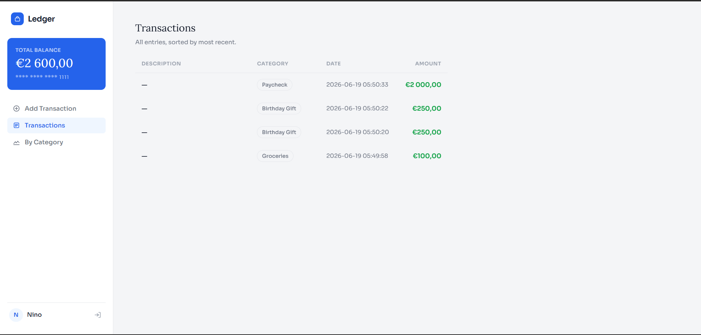
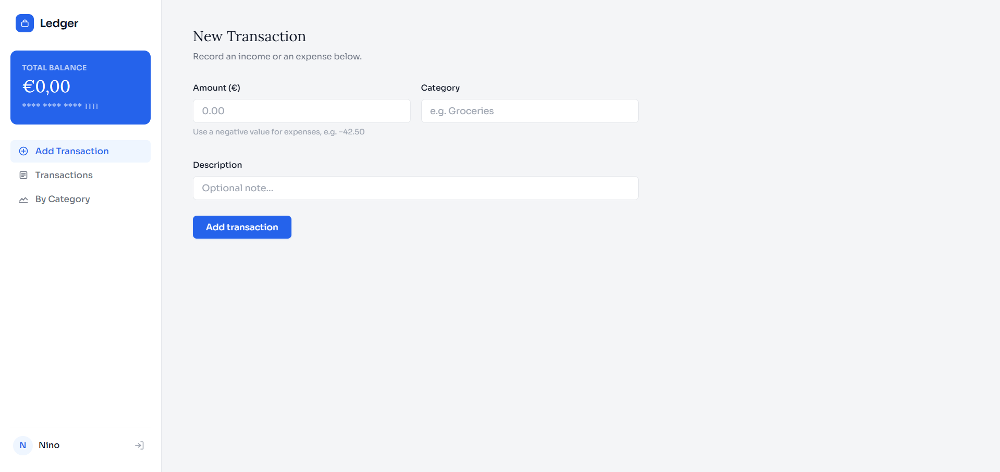
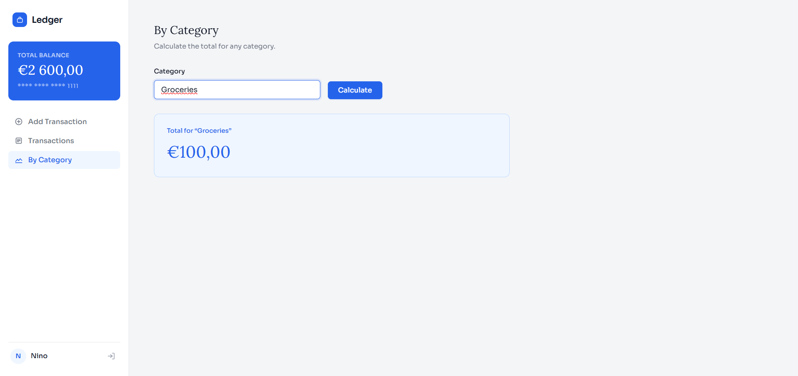

# Finance Tracker

A personal finance web app to track income and expenses, filter by category, and manage transactions — built with Python, Flask and MySQL.

[](https://finance-tracker-ohtz.onrender.com)
[](https://github.com/NinoMarinkovic/finance-tracker)
[](LICENSE)

---

## Tech Stack

**Backend:** Python, Flask  
**Database:** MySQL, PyMySQL (Aiven Cloud)  
**Frontend:** HTML, CSS, JavaScript  
**Testing:** pytest  
**Hosting:** Render  

---

## Screenshots







Screenshot Links:

- [Dashboard](https://via.placeholder.com/900x360.png?text=Finance+Tracker+Dashboard)
- [Transactions List](https://via.placeholder.com/900x360.png?text=Transactions+List)
- [Category Summary](https://via.placeholder.com/900x360.png?text=Category+Summary)

---

## Features

- **User Authentication** — Register and login with secure password hashing and a 3-attempt lockout
- **Transaction Management** — Add, view and manage income and expenses
- **Category Filtering** — Calculate totals by spending category
- **Persistent Storage** — All data stored in a MySQL database
- **Responsive UI** — Clean interface that works on all screen sizes
- **Unit Tests** — Core logic covered with pytest

---

## Project Structure

```
finance-tracker/
├── projects.py         # Flask backend & REST API
├── test_project.py     # Unit tests
├── requirements.txt    # Dependencies
├── templates/
│   └── index.html      # Main HTML template
└── static/
    ├── style.css       # Styling
    └── app.js          # Frontend logic & API calls
```

---

## Getting Started

### Option A — Run locally with XAMPP

**Prerequisites:** Python 3.x, XAMPP (MySQL via phpMyAdmin)

```bash
git clone https://github.com/NinoMarinkovic/finance-tracker.git
cd finance-tracker
pip install -r requirements.txt
```

Start XAMPP, then create the database:

```sql
CREATE DATABASE ledger;
```

Create a `.env` file:

```
DB_HOST=localhost
DB_PORT=3306
DB_USER=root
DB_PASSWORD=
DB_NAME=ledger
```

```bash
python projects.py
```

Open `http://127.0.0.1:5000` — tables are created automatically on first launch.

---

### Option B — Live Deployment (Render + Aiven)

**Live URL:** https://finance-tracker-ohtz.onrender.com

Set the following environment variables in Render → Environment:

| Key | Value |
|-----|-------|
| `DB_HOST` | your Aiven host |
| `DB_PORT` | your Aiven port |
| `DB_USER` | your Aiven user |
| `DB_PASSWORD` | your Aiven password |
| `DB_NAME` | defaultdb |

No secrets are stored in the repository.

---

## API Endpoints

| Method | Endpoint | Description |
|--------|----------|-------------|
| POST | `/api/register` | Create a new account |
| POST | `/api/login` | Sign in |
| POST | `/api/logout` | Sign out |
| GET | `/api/transactions` | Get all transactions & balance |
| POST | `/api/transactions` | Add a transaction |
| GET | `/api/transactions/category` | Get total by category |

---

## Running Tests

```bash
pytest test_project.py
```

---

## Security

- Passwords hashed with PBKDF2-HMAC-SHA256
- Credit card numbers masked before storage
- Login locked after 3 failed attempts
- Input validation on client and server side
- All sensitive config via environment variables — never hardcoded

---

## License

MIT — see [LICENSE](LICENSE)
